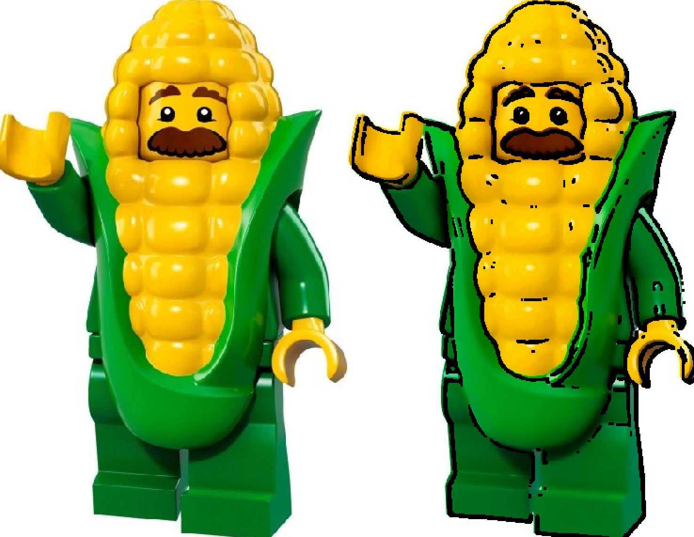
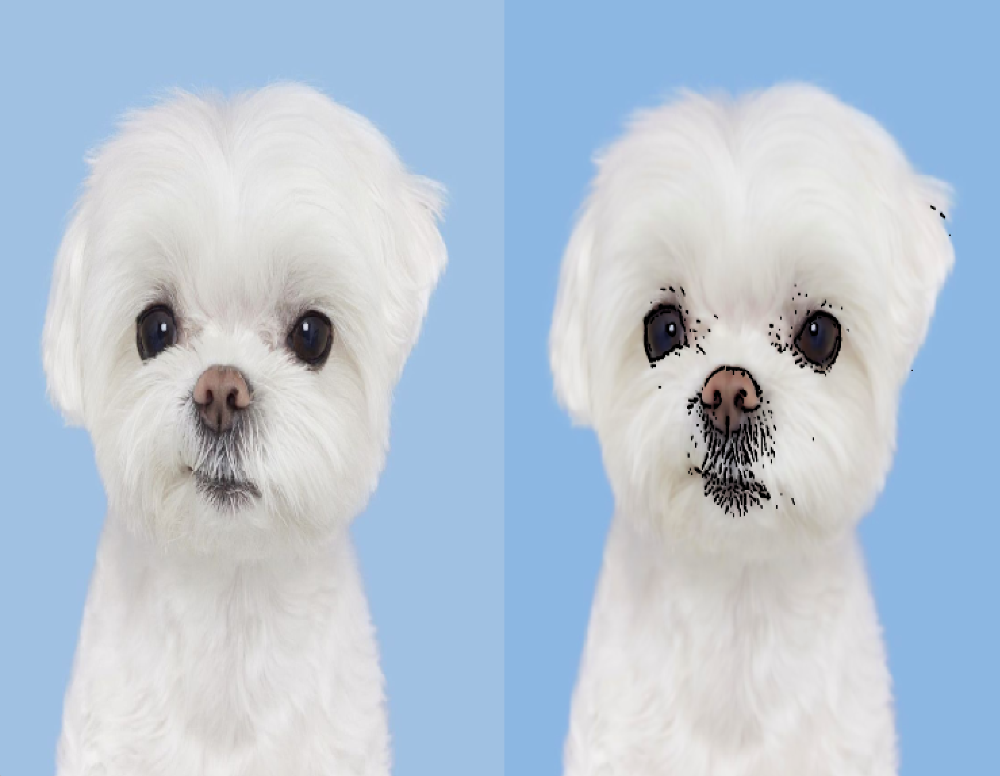

# CartoonVision

OpenCV를 이용하여 이미지를 만화 스타일로 변환하는 프로젝트입니다.  
Bilateral filtering, 채도 강조, adaptive threshold를 이용해 색을 단순화하고 외곽선을 강조합니다.

---

## 1. 알고리즘 개요

1. Bilateral Filter → 색 영역 부드럽게
2. 채도 증가 → 색을 더 선명하게 (HSV 공간에서 S 채널 증가)
3. Grayscale + Blur → 노이즈 감소
4. Adaptive Threshold → 외곽선 검출
5. Morphology → 잡음 제거 및 선 정리
6. 외곽선을 검은색으로 덮어쓰기

---

## 2. Demo

### (1) 만화 느낌이 잘 표현되는 경우

### (2) 만화 느낌이 잘 표현되지 않는 경우

---

## 3. 한계점

### 1. 텍스처에 매우 민감
adaptive threshold는 밝기 차이를 기준으로 하기 때문에  
털, 주름 등 미세한 디테일까지 외곽선으로 인식함 → 노이즈 증가

### 2. 실제 경계보다 작은 변화에 민감
큰 객체의 윤곽선보다 내부의 작은 밝기 변화가 더 강조되는 문제가 있음

### 3. 파라미터 의존성
- blockSize
- C 값
- blur 강도

에 따라 결과가 크게 달라지며, 모든 이미지에 동일하게 적용하기 어려움

### 4. 색 정보 활용 부족
외곽선 검출이 grayscale 기반이라 색 차이를 충분히 활용하지 못함

### 5. 채도 증가의 부작용
채도를 높이면 만화 느낌은 강화되지만,  
이미지에 따라 색이 과하게 강조되어 부자연스러울 수 있음
